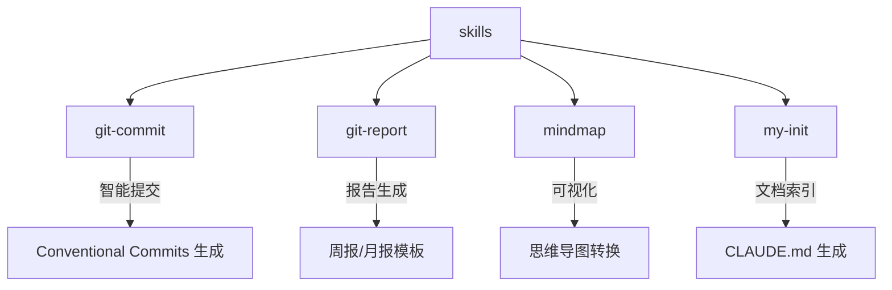

# Skills

> 生成时间：2026-02-09 03:12

## 概述

Claude Code Skills 集合项目，提供智能 Git 提交、工作报告生成、思维导图转换和项目初始化等扩展能力。

## 技术栈

- 语言：Markdown/Text
- 框架：Claude Code Skills
- 构建：ZIP (.skill 文件打包)

## 项目结构



## 模块索引

| 模块 | 路径 | 职责 |
|------|------|------|
| git-commit | [git-commit](git-commit/CLAUDE.md) | 分析 Git 改动，自动生成 Conventional Commits 格式提交信息 |
| git-report | [git-report](git-report/CLAUDE.md) | 基于 Git 提交记录生成周报/月报 |
| mindmap | [mindmap](mindmap/CLAUDE.md) | 将内容转换为可视化思维导图 |
| my-init | [my-init](my-init/CLAUDE.md) | 扫描项目生成分层 CLAUDE.md 索引文档 |

## Skill 文件说明

每个 `.skill` 文件是对应目录的 ZIP 打包：

- `git-commit.skill` → `git-commit/` 目录
- `git-report.skill` → `git-report/` 目录
- `mindmap.skill` → `mindmap/` 目录
- `my-init.skill` → `my-init/` 目录

## 安装命令

```bash
# 复制 skill 文件到 Claude 配置目录
cp *.skill ~/.claude/skills/
```

## 触发方式

| Skill | 斜杠命令 | 自然语言触发 |
|-------|----------|--------------|
| git-commit | `/git-commit` | - |
| git-report | - | "生成周报"、"生成月报" |
| mindmap | - | "生成思维导图" |
| my-init | `/my-init` | "初始化项目"、"生成项目文档" |
